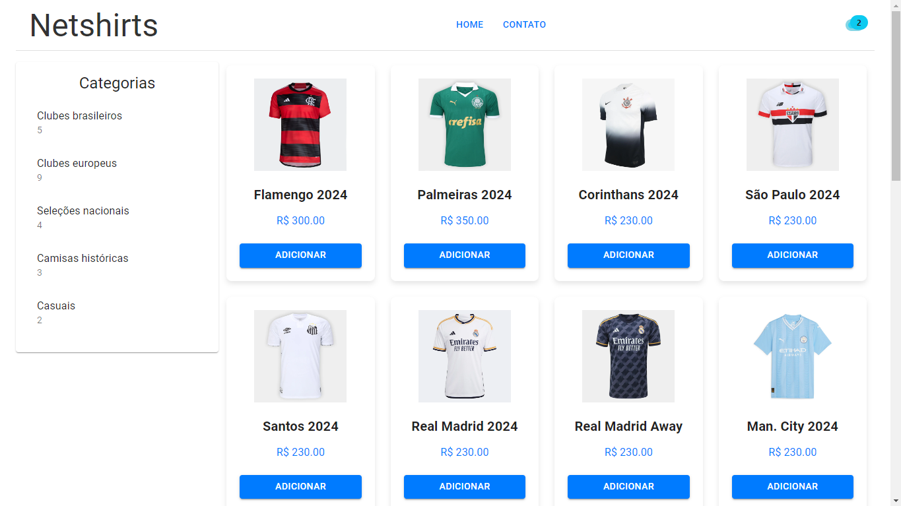

# 🛒 Integrando um Backend em Node.js com um Frontend em React para um E-commerce

Este projeto demonstra a integração de um backend em Node.js com um frontend em React para um sistema de E-commerce.

## 🎥 Demonstração

<div align="center">

[](https://react-ecommerce-ashy-nine.vercel.app/)

</div>

## ⚙️ Funcionalidades

- Adicionar produtos ao carrinho de compras.
- Editar a quantidade de itens no carrinho.
- Visualizar o resumo do carrinho com a quantidade de produtos e o preço total.


## 🛠️ Tecnologias Utilizadas

- **`Node.js`**: Ambiente de execução JavaScript para o desenvolvimento do lado do servidor.
- **`React`**: Biblioteca frontend para construção da interface de usuário.


## 🌐 Teste o Projeto

Você pode testar o projeto acessando o link abaixo:

[**🔗 Acesse o E-commerce Online**](https://react-ecommerce-ashy-nine.vercel.app/)

[](https://react-ecommerce-ashy-nine.vercel.app/)

## 🚀 Como Usar

📌 **1.** Clone o repositório:

```bash
git clone https://github.com/joschonarth/react-ecommerce
```

📌 **2.** Instale as dependências:

```bash
npm install
```

📌 **3.** Inicie o servidor:

```bash
npm run start
```

📌 **4.** Acesse a aplicação no navegador em `http://localhost:3000` para utilizar o e-commerce.

## 🗂️ Estrutura do Projeto

```bash
📁 react-ecommerce/
├── 📁 public/
│   └── 📄 index.html
├── 📁 src/
│   ├── 📁 components/
│   │   ├── 📁 Cart/
│   │   └── 📁 store/
│   │       ├── 📁 actions/
│   │       └── 📁 reducers/
│   ├── 📁 pages/
│   ├── 📁 styles/
│   ├── 📄 App.jsx
│   ├── 📄 index.jsx
│   └── 📄 routes.jsx
└── 📄 package.json
```

## 🤝 Contribuições

Sinta-se à vontade para fazer um fork deste repositório e enviar pull requests. Sugestões e melhorias são sempre bem-vindas!

## 📞 Contato 

<div>
    <a href="https://www.linkedin.com/in/joschonarth/" target="_blank"></a>
    <a href="mailto:joschonarth@gmail.com" target="_blank"></a>
</div>